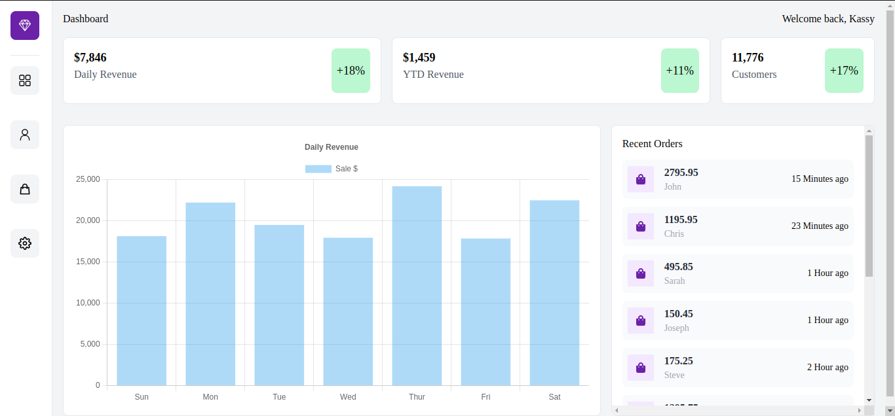

# Dashboard

Welcome to the my Dashboard application built with nextjs and tailwindcss!


## Home Page



## 🛠 Built With <a name="built-with"></a>

### Tech Stack <a name="tech-stack"></a>


<details>
  <summary>Nextjs</summary>
  <ul>
    <li><a>https://nextjs.org/</a></li>
  </ul>
</details>


<details>
  <summary>Typescript</summary>
  <ul>
    <li><a>https://www.typescriptlang.org/</a></li>
  </ul>
</details>

<details>
  <summary>Tailwind Css</summary>
  <ul>
    <li><a>https://tailwindcss.com/</a></li>
  </ul>
</details>

## 🖥️ Live Demo
[Link](https://dashboard-nextjs-tailwindcss.netlify.app/) :point_left:

## 💻 Getting Started with Create React App

This is a [Next.js](https://nextjs.org/) project bootstrapped with [`create-next-app`](https://github.com/vercel/next.js/tree/canary/packages/create-next-app).

#### To get a local copy run the following steps

- Copy this link `git@github.com:Qoosim/Dashboard-nextjs-tailwindcss.git`
- Open your terminal or command line
- Run git clone and paste the link
- Open the folder with your code editor
- Create a branch to work on

#### Then, run the development server

```bash
npm run dev
# or
yarn dev
# or
```

### Folder Structure

The folder structure looks something like this:

```sh
/public
/src
   |-- app
   |-- components
   |-- pages
.eslintrc.json
.gitignore
README.md
next.config.js
package-lock.json
package.json
postcss.config.js
tailwind.config.js
tsconfig.json
```

Open [http://localhost:3000](http://localhost:3000) with your browser to see the result.

You can start editing the page by modifying `app/page.tsx`. The page auto-updates as you edit the file.

This project uses [`next/font`](https://nextjs.org/docs/basic-features/font-optimization) to automatically optimize and load Inter, a custom Google Font.

## Learn More

To learn more about Next.js, take a look at the following resources:

- [Next.js Documentation](https://nextjs.org/docs) - learn about Next.js features and API.
- [Learn Next.js](https://nextjs.org/learn) - an interactive Next.js tutorial.

You can check out [the Next.js GitHub repository](https://github.com/vercel/next.js/) - your feedback and contributions are welcome!

## 🚀 Deploy on Vercel

The easiest way to deploy your Next.js app is to use the [Vercel Platform](https://vercel.com/new?utm_medium=default-template&filter=next.js&utm_source=create-next-app&utm_campaign=create-next-app-readme) from the creators of Next.js.

Check out our [Next.js deployment documentation](https://nextjs.org/docs/deployment) for more details.

## 🤝 Contributing <a name="contributing"></a>

Contributions, issues, and feature requests are welcome!
Feel free to check the [issues page](https://github.com/JUUBIX1/front-end/issues).
